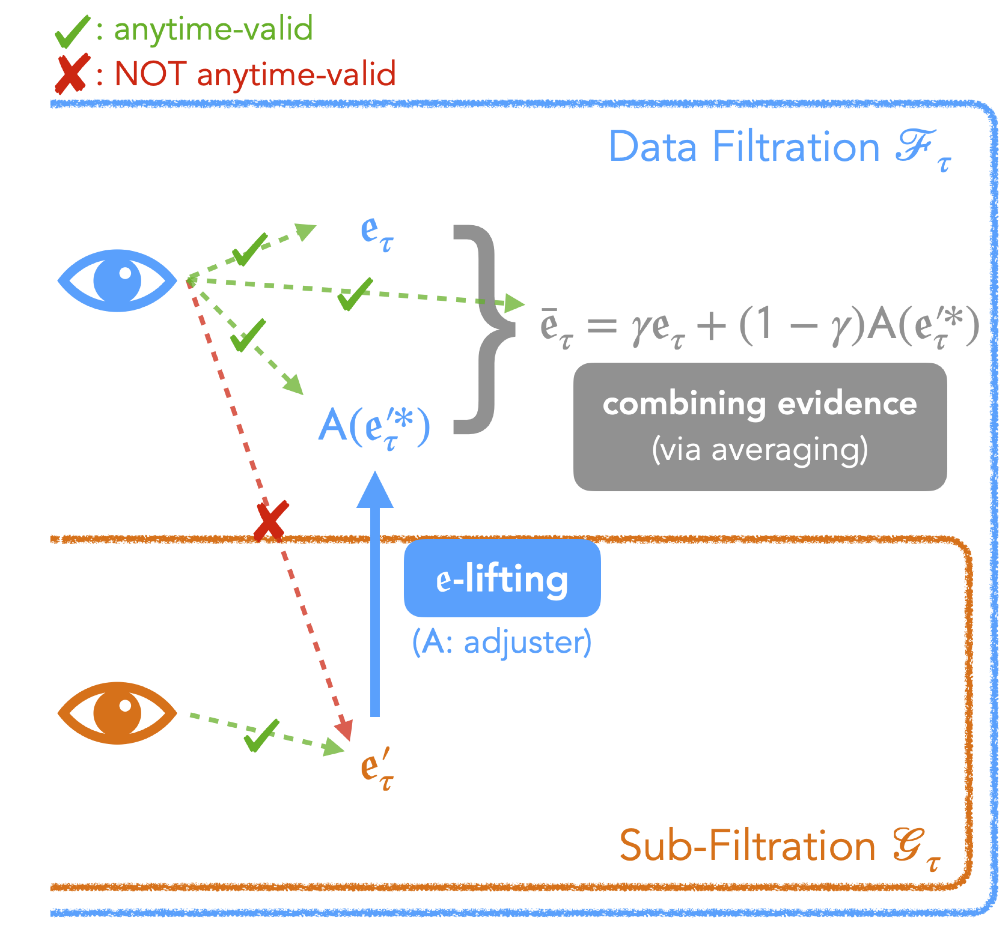

# ecombine

Python code accompanying our paper, [Combining Evidence Across Filtrations](https://arxiv.org/abs/2402.09698).



## Code Overview

[`ecombine/`](ecombine) is the source package that implements adjusters/calibrators, e-processes, data generators, and plotting functions.

The following notebooks contain code and plots related to various numerical results in the paper.

Main results:
* [`nb_exchangeability_elifting.ipynb`](nb_exchangeability_elifting.ipynb): 
  stopped e-values for testing randomness/exchangeability in null cases.
* [`nb_exchangeability_elifting_alternative.ipynb`](nb_exchangeability_elifting_alternative.ipynb): 
  stopped e-values for testing randomness/exchangeability in alternative cases.
* [`nb_exchangeability_adjuster_power.ipynb`](nb_exchangeability_adjuster_power.ipynb): 
  power comparisons between the adjust-then-combine approach and the simple mean (invalid) approach.
* [`nb_stock_parity_highvoldays.ipynb`](nb_stock_parity_highvoldays.ipynb): 
  testing randomness of high-volatility days in stock data.
* [`nb_compare_kstep_forecasters.ipynb`](nb_compare_kstep_forecasters.ipynb): 
  sequential tests and e-processes for comparing k-step-ahead forecasters.

Extra results:
* [`nb_adjusters.ipynb`](nb_adjusters.ipynb): 
  plots of various adjusters
* [`nb_exchangeability_elifting_spine_adjusters.ipynb`](nb_exchangeability_elifting_spine_adjusters.ipynb): 
  includes the estimate for the stopped e-value when using the spine adjuster.
* [`nb_exchangeability_elifting_randomization.ipynb`](nb_exchangeability_elifting_randomization.ipynb): 
  includes the estimate for the type I error of the randomize-then-lift procedure.

## Installation

```sh
git clone https://github.com/yjchoe/CombiningEvidenceAcrossFiltrations
cd CombiningEvidenceAcrossFiltrations

pip install --upgrade pip
pip install -r requirements.txt
pip install -e .
```

## Sample Usage

The following code combines the UI and conformal e-processes for testing exchangeability given a binary data sequence:
```python
import numpy as np
import matplotlib.pyplot as plt

import ecombine as ec

# generate data with a "shock" changepoint
rng = np.random.default_rng(2024)
T = 2000
p, q = 0.5, 0.2
change_loc, change_len = 0.2, 0.04
x = ec.data.exch.generate_binary_changepoint(
    p=p, q=q, size=T, 
    change_loc=change_loc, change_len=change_len, rng=rng,
)

# compute e-processes; the conformal variant requires adjustment for anytime-validity wrt data
e_ui = ec.eprocess_exch_universal(x)
e_conf = ec.eprocess_exch_conformal(
    x, jump=0.01, jumper_weights=(1/3, 1/3, 1/3), rng=rng,
)

# combined e-process is valid at any data-dependent stopping times!
e_combined = 0.5 * e_ui + 0.5 * ec.adjuster(e_conf)

# plotting
ec.set_theme()
fg = ec.plot_eprocess(
    [e_ui, e_conf, e_combined],
    ["UI", "Conformal", "eLift+Avg"],
    title="E-processes for Testing Exchangeability",
)
plt.show()
```

See further usage in [`nb_exchangeability_elifting_alternative.ipynb`](nb_exchangeability_elifting_alternative.ipynb).

## Code License

MIT

## Authors

[YJ Choe](http://yjchoe.github.io/) and 
[Aaditya Ramdas](https://www.stat.cmu.edu/~aramdas/)

## Citation

If you use parts of our work, please cite our paper as follows:

APA:
> Choe, Y. J., & Ramdas, A. (2024). Combining evidence across filtrations. _arXiv preprint arXiv:2402.09698_.

BibTeX:
```bibtex
@article{choe2024combining,
  title={Combining Evidence Across Filtrations},
  author={Choe, Yo Joong and Ramdas, Aaditya},
  journal={arXiv preprint arXiv:2402.09698},
  year={2024}
}
```
